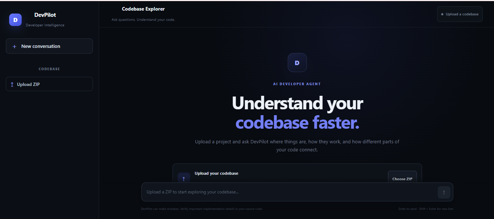
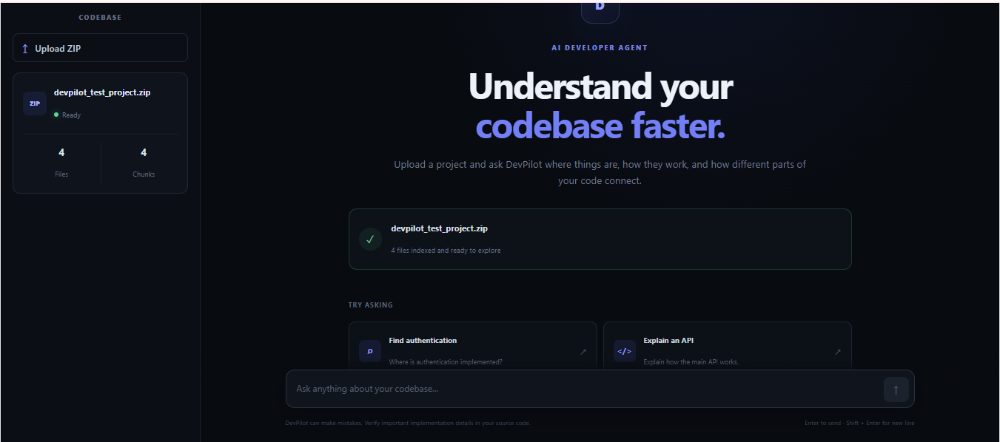
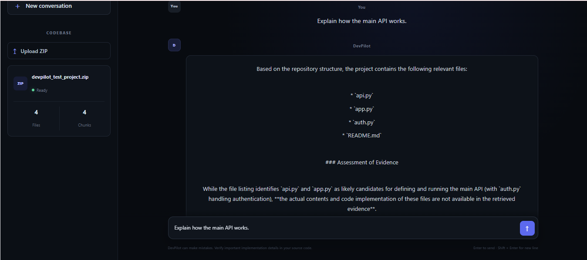

# 🚀 DevPilot — AI Developer Knowledge Agent

> Understand any codebase faster with AI-powered code search, RAG, and repository-aware intelligence.

DevPilot is an AI-powered developer knowledge agent that allows developers to upload a project and ask natural-language questions about its implementation.

Instead of manually searching through hundreds of files, developers can ask questions such as:

- Where is authentication implemented?
- Which files handle JWT validation?
- How does this API work?
- What happens when a user creates a task?
- How do these files work together?

DevPilot retrieves relevant code using **Retrieval-Augmented Generation (RAG)** and **FAISS**, generates grounded answers using **Google Gemini**, and can inspect the repository using **Model Context Protocol (MCP)** tools when additional information is required.

---

## 🌐 Live Demo

**Frontend:**  
https://devpilot-fawn.vercel.app/

**Backend API:**  
https://devpilot-v9s8.onrender.com

---

## 📸 Screenshots

### DevPilot Home



### Uploaded Codebase



### AI Codebase Analysis



---

## ✨ Features

- 📦 Upload a project as a ZIP file
- 🤖 AI-powered codebase question answering
- 🔎 Semantic code search using RAG
- 🧠 Gemini-powered embeddings and responses
- ⚡ FAISS vector similarity search
- 🛠️ MCP repository tools
- 📁 Repository-aware answers
- 📍 File and line-number references
- 🔗 Multi-file implementation tracing
- 🖥️ Professional developer-focused interface
- ☁️ Deployed frontend and backend

---

## 🧠 Example

A developer can upload a project and ask:

> **Where is JWT validation implemented?**

DevPilot analyzes the uploaded repository and identifies the relevant implementation.

For example:

```text
auth.py
   ↓
verify_token()
   ↓
api.py
   ↓
get_profile()
   ↓
app.py
   ↓
handle_request()

🏗️ Architecture
                    ┌──────────────────────┐
                    │      Developer       │
                    │                      │
                    │ Upload ZIP + Ask     │
                    │ Questions            │
                    └──────────┬───────────┘
                               │
                               ▼
                    ┌──────────────────────┐
                    │   React + Vite UI    │
                    │       Vercel         │
                    └──────────┬───────────┘
                               │
                               ▼
                    ┌──────────────────────┐
                    │    FastAPI Backend   │
                    │       Render         │
                    └──────────┬───────────┘
                               │
                ┌──────────────┼──────────────┐
                │              │              │
                ▼              ▼              ▼
        ┌─────────────┐ ┌─────────────┐ ┌─────────────┐
        │ Codebase    │ │     RAG     │ │     MCP     │
        │ Ingestion   │ │             │ │ Repository  │
        │             │ │ Gemini      │ │ Tools       │
        │ Loader      │ │ Embeddings  │ │             │
        │ Chunker     │ │ + FAISS     │ │ Search      │
        └─────────────┘ └─────────────┘ │ Read Files  │
                                        │ List Files  │
                                        └──────┬──────┘
                                               │
                                               ▼
                                    ┌──────────────────┐
                                    │  Google Gemini   │
                                    │                  │
                                    │ Context-aware AI │
                                    │ Response         │
                                    └────────┬─────────┘
                                             │
                                             ▼
                                    ┌──────────────────┐
                                    │ Answer + Sources │
                                    │ File + Lines     │
                                    └──────────────────┘
🔍 How DevPilot Works
1. Upload

The developer uploads a project as a ZIP file.

DevPilot extracts the project and identifies supported source files.

Supported file types include:

.py
.js
.jsx
.ts
.tsx
.json
.md
.css
.html

Common generated directories and lock files are ignored.

2. Codebase Ingestion

DevPilot scans the uploaded repository and extracts metadata such as:

File path
Filename
Language
File extension
Source code

The source code is then divided into manageable chunks.

Each chunk stores:

File path
Programming language
Start line
End line
Code content
3. Embeddings

The code chunks are converted into vector embeddings using Gemini Embeddings.

These embeddings represent the semantic meaning of the code and allow DevPilot to find code that is conceptually relevant to a developer's question.

4. Vector Search

DevPilot uses FAISS for similarity search.

When a user asks a question:

User Question
      ↓
Question Embedding
      ↓
FAISS Similarity Search
      ↓
Most Relevant Code Chunks

The most relevant code chunks are retrieved and provided to the AI model as context.

5. AI Reasoning

The retrieved code context is passed to Google Gemini.

DevPilot instructs the model to:

Use the uploaded repository as the source of truth
Avoid inventing implementation details
Mention relevant files
Include line numbers when available
Explain relationships between files
Clearly distinguish facts from inference
Give practical and direct answers
6. MCP Repository Tools

When the retrieved RAG context is insufficient, DevPilot can use repository tools through the Model Context Protocol (MCP).

Current repository tools include:

list_repository_files
search_codebase
read_repository_file

These tools allow DevPilot to inspect repository files and search the codebase when additional evidence is required.

7. Source References

DevPilot returns source information along with the answer.

Example:

auth.py
Python
Lines 7–10

api.py
Python
Lines 1–5

This allows developers to verify AI-generated explanations against the actual source code.

🛠️ Tech Stack
Frontend
React
Vite
JavaScript
CSS
Backend
Python
FastAPI
Uvicorn
AI
Google Gemini
Gemini Embeddings
RAG
FAISS
Vector similarity search
Repository Intelligence
Model Context Protocol (MCP)
Deployment
Vercel — Frontend
Render — Backend
📁 Project Structure
DevPilot/
│
├── backend/
│   │
│   ├── rag/
│   │   ├── __init__.py
│   │   ├── loader.py
│   │   ├── chunker.py
│   │   ├── embeddings.py
│   │   └── vector_store.py
│   │
│   ├── mcp_tools/
│   │   ├── tools.py
│   │   └── server.py
│   │
│   ├── mcp_client.py
│   ├── main.py
│   └── requirements.txt
│
├── frontend/
│   │
│   ├── src/
│   │   ├── App.jsx
│   │   └── App.css
│   │
│   ├── package.json
│   └── vite.config.js
│
├── docs/
│   ├── 01-home.png
│   ├── 02-uploaded-codebase.png
│   └── 03-ai-answer.png
│
├── .gitignore
└── README.md
🔌 API Endpoints
Health Check
GET /api/health

Returns backend health and whether a project is currently loaded.

Upload Project
POST /api/upload

Uploads and processes a ZIP codebase.

Example response:

{
  "success": true,
  "filename": "project.zip",
  "files": 20,
  "chunks": 45,
  "message": "Project uploaded successfully."
}
Ask DevPilot
POST /api/chat

Example request:

{
  "message": "Where is JWT validation implemented?"
}

Example response:

{
  "answer": "JWT validation is implemented in auth.py...",
  "sources": [
    {
      "path": "auth.py",
      "language": "Python",
      "start_line": 7,
      "end_line": 10
    }
  ]
}
🚀 Running Locally
Backend

Navigate to the backend:

cd backend

Create a virtual environment:

python -m venv venv

Activate it:

venv\Scripts\activate

Install dependencies:

pip install -r requirements.txt

Create:

backend/.env

Add:

GEMINI_API_KEY=your_gemini_api_key

Start the backend:

uvicorn main:app --reload

Backend:

http://localhost:8000
Frontend

Open another terminal:

cd frontend

Install dependencies:

npm install

Start the development server:

npm run dev

Frontend:

http://localhost:5173

The frontend API URL is configured using:

VITE_API_URL=http://localhost:8000/api
🔐 Security

DevPilot is designed so that uploaded projects are processed by the backend during the active application session.

Runtime uploads and environment files are excluded from Git using .gitignore.

Sensitive credentials such as:

GEMINI_API_KEY

should never be committed to GitHub.

⚠️ Current Limitations
Large repositories can take longer to index.
The first question after uploading a project can take longer because embeddings need to be generated.
The backend currently maintains the active uploaded project in memory.
Render's free instance can experience cold-start delays after inactivity.
AI-generated explanations should still be verified against the source code.
🔮 Future Improvements
Persistent vector databases
Incremental repository indexing
GitHub repository integration
Multiple simultaneous projects
Conversation history
User authentication
Streaming AI responses
Improved code-aware chunking
AST-based code analysis
Dependency graph visualization
Background indexing for large repositories
More advanced MCP agent workflows
📚 What I Learned

Building DevPilot provided practical experience with:

Full-stack application development
React + Vite
FastAPI
REST APIs
Gemini APIs
Embeddings
Retrieval-Augmented Generation (RAG)
FAISS vector search
Semantic search
Model Context Protocol (MCP)
Repository/codebase analysis
Frontend-backend integration
CORS configuration
Cloud deployment
Vercel
Render
Git and GitHub
📊 Project Status

Completed and Deployed 🚀

Component	Status
React Frontend	✅ Live
FastAPI Backend	✅ Live
ZIP Upload	✅ Working
RAG Search	✅ Working
Gemini AI	✅ Working
FAISS Vector Search	✅ Working
MCP Repository Tools	✅ Integrated
Source References	✅ Working
Vercel Deployment	✅ Live
Render Deployment	✅ Live
🌐 Links

Live Application:
https://devpilot-fawn.vercel.app/

Backend API:
https://devpilot-v9s8.onrender.com

GitHub Repository:
https://github.com/eesha-mishra28/Devpilot

👩‍💻 Author

Eesha Mishra

Software Developer